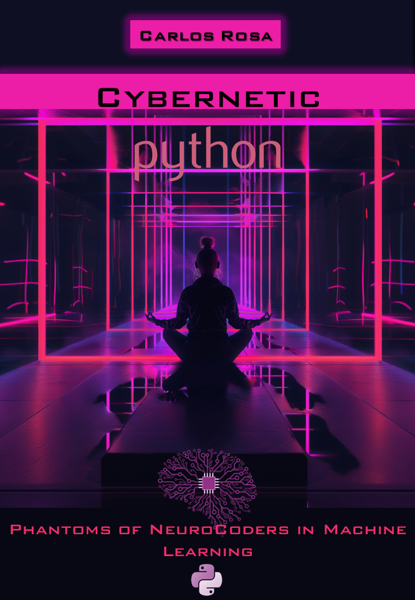

    

-------

# Projeto EBOOK Gerado por I.A.s

 > ℹ️ **NOTE:** Este é o repositório desenvolvido durante o curso na plataforma da [DIO](https://dio.me)

Projeto com o objetivo de gerar um ebook digital com as facilidades das ferramentas de IA. todos os prompts
seguem abaixo.

<a href="https://github.com/Synth-ShellZ/ebook-Cybernetic-Python-Phantom-of-NeuroCoders-in-Machine-Learning/blob/main/output/ebook-Cybernetic-Python-Phantoms-of-NeuroCoders-in-Machine-Learning.pdf" title="View PDF now"> 📕Clique aqui para ler</a>

## 💻 Tecnologias utilizadas no projeto

- [ChatGPT](https://chat.openai.com/) 
- [MidJourney](https://www.midjourney.com/app/)
- [PowerPoint](https://www.microsoft.com/en/microsoft-365/powerpoint)

## 🧠 Prompts

ChatGPT：

|   Ação   | prompt                                                                                                                                                                                                                                                                         |
| :------: | ------------------------------------------------------------------------------------------------------------------------------------------------------------------------------------------------------------------------------------------------------------------------------ |
|  título  | crie um título de um ebook sobre o tema de machine learning, o ebook é do nicho de programação e subnicho machine learning utilizando a linguagem python, o título deve ser épico e curto e tenha uma temática cyberpunk, me liste 5 variações de título                                                        |
| conteúdo | Faça um texto para ebook com foco em Machine learning utilizando a linguagem python, listando os principais pontos técnicos para se aprender em ordem de aprendizado{REGRAS}#>explique sempre de uma maneira simples#>Deixe o texto enxuto#>Sempre traga exemplos de código em contexto reais#>Sempre deixe um título sugestivo por tópico e que lembre a temática retrowaveo./ Complemente com mais capítulos./ Pegue os primeiros  três capítulos e os descreva com mais detalhes{REGRAS}#>Mantenha a mesma estrutura do ebook#>Discorra mais detalhadamente cada tema#>Utilize código para explicar sempre que necessário |

Midjourney：

|  Ação  | prompt                                                                                 |
| :----: | -------------------------------------------------------------------------------------- |
| título | a cyberpunk woman meditating in the center of a black room without light well positioned to be a cover of a e-book of programming. Consider using colors from a minimalist retrowave aesthetics. make without a background, like she is in the space with very little light. --v 6.0 |

## ✨ Features

- Conteúdo gerado via ChatGPT
- Imagens geradas via MidJourney

## 📚 Materiais

- Imagens utilizadas em `assets`
- ebook gerado durante as aulas em `output`

## 🛠️ Instruções de execução

Utilize os prompts acima nas ferramentas sugeridas para gerar o material base e utilize uma ferramenta de edição de documentos como power point, libreoffice , indesign para diagramação.

## 👨‍💻 Expert

    
&nbsp&nbsp&nbspCarlos Rosa  
    &nbsp&nbsp&nbsp
    <a href="https://github.com/Synth-ShellZ">
    GitHub</a>&nbsp;|&nbsp;
    <a href="www.linkedin.com/in/carlos-eduardo-rosa-6b6a5b280">LinkedIn</a>
&nbsp;|&nbsp;
    <a href="https://www.instagram.com/eeduardorosa/">
    Instagram</a>
&nbsp;|&nbsp;

  

---

⌨️ com 💜 por [Carlos Rosa](https://github.com/Synth-ShellZ)
